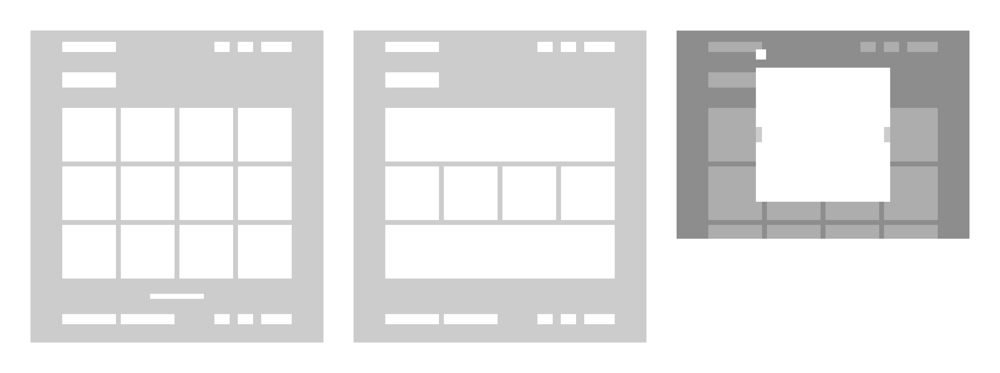

# Galeria de fotos

Recentemente li um artigo do Clóvis Neto sobre a [criação de componentes apenas com CSS](https://clovisdasilvaneto.github.io/criando-componentes-apenas-com-css) e fiquei extremamente interessado no assunto, principalmente na aparente melhora de performance da página. Dito isso, decidi criar uma galeria de fotos com a maior quantidade de componentes em puro CSS possível.

### Detalhes do projeto

O objetivo é criar uma página única para a visualização de um produto, que deve conter as seguintes características:

- Ser responsível
- Conter uma lightbox
- Não utilizar bibliotecas CSS
- Manter uma estética coerente

### Interface de Usuário

