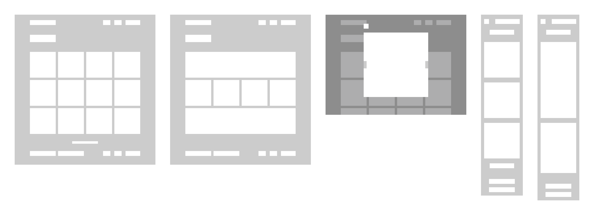

# Galeria de fotos

Recentemente li um artigo do Clóvis Neto sobre a [criação de componentes apenas com CSS](https://clovisdasilvaneto.github.io/criando-componentes-apenas-com-css) e fiquei extremamente interessado no assunto, principalmente na aparente melhora de performance da página. Dito isso, decidi criar uma galeria de fotos com a maior quantidade de componentes em puro CSS possível.

O projeto foi desenvolvido utilizando a framework **React.js** e as tecnologias **CSS, SASS e JavaScript**. Já para o desenvolvimento da Interface de Usuário, utilizei a ferramenta **Figma**, além dos plugins **Iconify e Unsplash**.

### Detalhes do projeto

O objetivo é criar uma página única para a visualização de um produto, que deve conter as seguintes características:

- Ser responsivo.
- Conter uma lightbox.
- Não utilizar bibliotecas CSS.
- Manter uma estética coerente.

### Interface de Usuário

Alguns detalhes da interface são:

- A API utilizada é a da [Pexels.](https://www.pexels.com/api/documentation/#photos)
- Os ícones utilizados são da [Box Icons.](https://boxicons.com/)
- Existirão três telas: Fotos, Lightbox\* e Sobre.
- O projeto contará com modo claro e modo escuro.

\*Na versão mobile, a Lightbox não está presente.

| Wireframe |
| --------- |

| Protótipo |
| --------- |

### Desenvolvimento

#### Organizando os Arquivos

Comecei o projeto organizando todas as pastas. As telas foram para a pasta **container**, já os componentes básicos da aplicação, como o slider e o header, foram para a pasta **components** e todos os arquivos SVG foram colocados na **assets**. Para facilitar a troca do tema, decidi centralizar todos os estilos globais em uma pasta chamada **style** que contém o arquivo _global.scss_.

#### Criando o theme switcher

Comecei o desenvolvimento do **theme switcher** no arquivo SCSS. Criei um estilo chamado _theme_ utilizando **@mixin** e defini as variáveis _$main-color, $bg-color e $secondary-color_.

Então criei dois IDs, o _light-theme_ e o _dark-theme_, utilizei **@include** para reaproveitar os códigos de _theme_, apenas alterando as variáveis quando foi necessário. Segue parte do código para exemplificação:

    @mixin theme($main-color: #1C1C1E, $bg-color: #F1FAFC, $secondary-color: darkBlue)
        #body {
            color: $main-color;
            background-color: $bg-color;
            font-family: -apple-system, BlinkMacSystemFont, Roboto, Ubuntu, "Open Sans",
              "Helvetica Neue", sans-serif;

        // outros códigos de estilo
        }
    }

    #light-theme {
        @include theme
    }

    #dark-theme {
        @include theme($main-color: #f1fafc, $bg-color: #1c1c1e, $secondary-color: lightBlue)
    }

Note que todos os códigos de estilo aplicados globalmente estão dentro de _theme_, [clique aqui](./src/style/global.scss) para acessar o codigo completo.
Caso ainda tenha alguma dúvida sobre a utilização de **@mixin** e **@include**, acesse a documentação do [SASS](https://sass-lang.com/documentation/at-rules/mixin)

Em cada página do projeto, utilizando o _useState_, adicionei variáveis em todos os locais necessários para a mudança de tema e então criei um _useEffect_ que lidasse com todas as alterações. De forma resumida, a ação _onClick_ dos botões disparam a função **setDarkTheme()** que altera o valor de _darkMode_ para _true_ ou _false_ e então o _useEffect_ executa todas as mudancas previstas.
